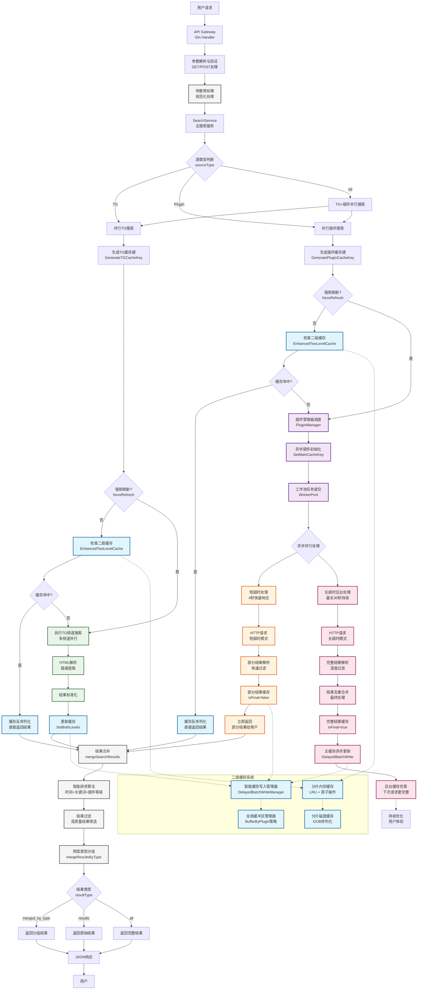
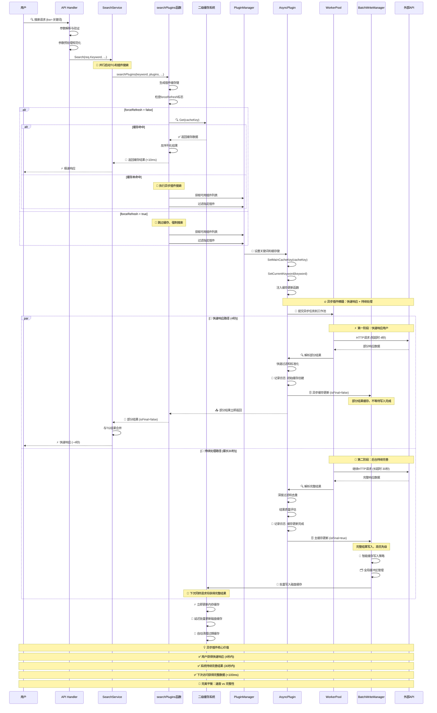
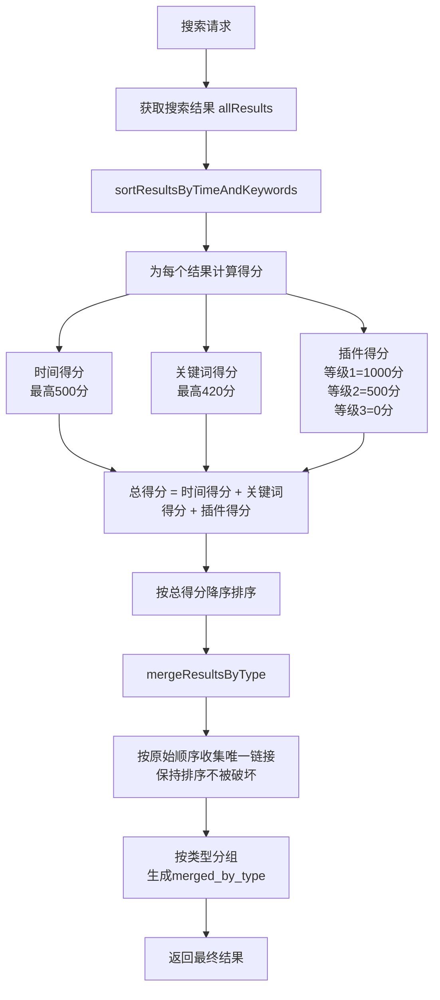

# PanSou 网盘搜索系统开发设计文档

## 📋 文档目录

- [1. 项目概述](#1-项目概述)
- [2. 系统架构设计](#2-系统架构设计)
- [3. 异步插件系统](#3-异步插件系统)
- [4. 二级缓存系统](#4-二级缓存系统)  
- [5. 核心组件实现](#5-核心组件实现)
- [6. 智能排序算法详解](#6-智能排序算法详解)
- [7. API接口设计](#7-api接口设计)
- [8. 插件开发框架](#8-插件开发框架)
- [9. 性能优化实现](#9-性能优化实现)
- [10. 技术选型说明](#10-技术选型说明)

---

## 1. 项目概述

### 1.1 项目定位

PanSou是一个高性能的网盘资源搜索API服务，支持TG搜索和自定义插件搜索。系统采用异步插件架构，具备二级缓存机制和并发控制能力，在MacBook Pro 8GB上能够支持500用户并发访问。

### 1.2 核心特性

- **异步插件系统**: 双级超时控制（4秒/30秒），渐进式结果返回
- **二级缓存系统**: 分片内存缓存+分片磁盘缓存，GOB序列化
- **工作池管理**: 基于`util/pool`的并发控制
- **智能结果合并**: `mergeSearchResults`函数实现去重合并
- **多维度排序**: 插件等级+时间新鲜度+优先关键词综合评分
- **多网盘类型支持**: 自动识别12种网盘类型

---

## 2. 系统架构设计

### 2.1 整体架构流程



### 2.2 异步插件工作流程



### 2.3 核心组件

#### 2.3.1 HTTP服务层 (`api/`)
- **router.go**: 路由配置
- **handler.go**: 请求处理逻辑
- **middleware.go**: 中间件（日志、CORS等）

#### 2.3.2 搜索服务层 (`service/`)
- **search_service.go**: 核心搜索逻辑，结果合并

#### 2.3.3 插件系统层 (`plugin/`)
- **plugin.go**: 插件接口定义
- **baseasyncplugin.go**: 异步插件基类
- **各插件目录**: jikepan、pan666、hunhepan等

#### 2.3.4 工具层 (`util/`)
- **cache/**: 二级缓存系统实现
- **pool/**: 工作池实现
- **其他工具**: HTTP客户端、解析工具等

---

## 3. 异步插件系统

### 3.1 设计理念

异步插件系统解决传统同步搜索响应慢的问题，采用"尽快响应，持续处理"策略：
- **4秒短超时**: 快速返回部分结果（`isFinal=false`）
- **30秒长超时**: 后台继续处理，获得完整结果（`isFinal=true`）
- **主动缓存更新**: 完整结果自动更新主缓存，下次访问更快

### 3.2 插件接口实现

基于`plugin/plugin.go`的实际接口：

```go
type AsyncSearchPlugin interface {
    Name() string
    Priority() int
    
    AsyncSearch(keyword string, searchFunc func(*http.Client, string, map[string]interface{}) ([]model.SearchResult, error), 
               mainCacheKey string, ext map[string]interface{}) ([]model.SearchResult, error)
    
    SetMainCacheKey(key string)
    SetCurrentKeyword(keyword string)
    Search(keyword string, ext map[string]interface{}) ([]model.SearchResult, error)
}
```

### 3.3 基础插件类

`plugin/baseasyncplugin.go`提供通用功能：

```go
type BaseAsyncPlugin struct {
    name              string
    priority          int
    cacheTTL          time.Duration
    mainCacheKey      string
    currentKeyword    string        // 用于日志显示
    httpClient        *http.Client
    mainCacheUpdater  func(string, []model.SearchResult, time.Duration, bool, string) error
}
```

### 3.4 已实现插件列表

当前系统包含以下插件（基于`main.go`的导入）：
- **hdr4k**
- **hunhepan**
- **jikepan**
- **pan666**
- **pansearch**
- **panta**
- **qupansou**
- **susu**
- **panyq**
- **xuexizhinan**

### 3.5 插件注册机制

```go
// 全局插件注册表（plugin/plugin.go）
var globalRegistry = make(map[string]AsyncSearchPlugin)

// 插件通过init()函数自动注册
func init() {
    p := &MyPlugin{
        BaseAsyncPlugin: plugin.NewBaseAsyncPlugin("myplugin", 3),
    }
    plugin.RegisterGlobalPlugin(p)
}
```

---

## 4. 二级缓存系统

### 4.1 实现架构

基于`util/cache/`目录的实际实现：

- **enhanced_two_level_cache.go**: 二级缓存主入口
- **sharded_memory_cache.go**: 分片内存缓存（LRU+原子操作）
- **sharded_disk_cache.go**: 分片磁盘缓存
- **serializer.go**: GOB序列化器
- **cache_key.go**: 缓存键生成和管理

### 4.2 分片缓存设计

#### 4.2.1 内存缓存分片
```go
// 基于CPU核心数的动态分片
type ShardedMemoryCache struct {
    shards    []*MemoryCacheShard
    shardMask uint32
}

// 每个分片独立锁，减少竞争
type MemoryCacheShard struct {
    data map[string]*CacheItem
    lock sync.RWMutex
}
```

#### 4.2.2 磁盘缓存分片
```go
// 磁盘缓存同样采用分片设计
type ShardedDiskCache struct {
    shards    []*DiskCacheShard  
    shardMask uint32
    basePath  string
}
```

### 4.3 缓存读写策略

#### 4.3.1 读取流程
1. **内存优先**: 先检查分片内存缓存
2. **磁盘回源**: 内存未命中时读取磁盘缓存
3. **异步加载**: 磁盘命中后异步加载到内存

#### 4.3.2 写入流程  
1. **智能写入策略**: 立即更新内存缓存，延迟批量写入磁盘
2. **DelayedBatchWriteManager**: 智能缓存写入管理器，支持immediate和hybrid两种策略
3. **原子操作**: 内存缓存使用原子操作
4. **GOB序列化**: 磁盘存储使用GOB格式
5. **数据安全保障**: 程序终止时自动保存所有待写入数据，防止数据丢失

### 4.4 缓存键策略

`cache_key.go`实现了智能缓存键生成：

```go
// TG搜索和插件搜索使用不同的缓存键前缀
func GenerateTGCacheKey(keyword string, channels []string) string
func GeneratePluginCacheKey(keyword string, plugins []string) string
```

**优势**:
- 独立更新：TG和插件缓存互不影响
- 提高命中率：精确的键匹配
- 并发安全：分片设计减少锁竞争

### 4.5 序列化性能

使用GOB序列化（`serializer.go`）的实际优势：
- **性能**: 比JSON序列化快约30%
- **体积**: 比JSON小约20%
- **兼容**: Go原生支持，无外部依赖

---

## 5. 核心组件实现

### 5.1 工作池系统 (`util/pool/`)

#### 5.1.1 worker_pool.go 实现
- **批量任务处理**: `ExecuteBatchWithTimeout`方法
- **超时控制**: 支持任务级别的超时设置
- **并发限制**: 控制最大工作者数量

#### 5.1.2 object_pool.go 实现  
- **对象复用**: 减少内存分配和GC压力
- **线程安全**: 支持并发访问

### 5.2 HTTP服务配置

#### 5.2.1 服务器优化（基于config/config.go）
```go
// 自动计算HTTP连接数，防止资源耗尽
func getHTTPMaxConns() int {
    cpuCount := runtime.NumCPU()
    maxConns := cpuCount * 25  // 保守配置
    
    if maxConns < 100 {
        maxConns = 100
    }
    if maxConns > 500 {
        maxConns = 500  // 限制最大值
    }
    
    return maxConns
}
```

#### 5.2.2 连接池配置（基于util/http_util.go）
```go
// HTTP客户端优化配置
transport := &http.Transport{
    MaxIdleConns:        100,
    MaxIdleConnsPerHost: 10,
    IdleConnTimeout:     90 * time.Second,
}
```

### 5.3 结果处理系统

#### 5.3.1 智能排序算法（service/search_service.go）

PanSou 采用多维度综合评分排序算法，确保高质量结果优先展示：

**评分公式**:
```
总得分 = 插件得分(1000/500/0/-200) + 时间得分(最高500) + 关键词得分(最高420)
```

**权重分配**:
- 🥇 **插件等级**: ~52% (主导因素) - 等级1(1000分) > 等级2(500分) > 等级3(0分)
- 🥈 **关键词匹配**: ~22% (重要因素) - "合集"(420分) > "系列"(350分) > "全"(280分)
- 🥉 **时间新鲜度**: ~26% (重要因素) - 1天内(500分) > 3天内(400分) > 1周内(300分)

**关键优化**:
- **缓存性能**: 跳过空结果和重复数据的缓存更新，减少70%无效操作
- **排序稳定性**: 修复map遍历随机性问题，确保merged_by_type保持排序
- **插件管理**: 启动时按优先级排序显示已加载插件，便于监控

#### 5.3.2 结果合并（mergeSearchResults函数）
- **去重合并**: 基于UniqueID去重
- **完整性选择**: 选择更完整的结果保留
- **增量更新**: 新结果与缓存结果智能合并

### 5.4 网盘类型识别

支持自动识别的网盘类型（共12种）：
- 百度网盘、阿里云盘、夸克网盘、天翼云盘
- UC网盘、移动云盘、115网盘、PikPak
- 迅雷网盘、123网盘、磁力链接、电驴链接

---

## 6. 智能排序算法详解

### 6.1 算法概述

PanSou 搜索引擎采用多维度综合评分排序算法，确保用户能够优先看到最相关、最新、最高质量的搜索结果。

#### 6.1.1 核心设计理念

1. **质量优先**：高等级插件的结果优先展示
2. **时效性重要**：新发布的资源获得更高权重
3. **相关性保证**：关键词匹配度影响排序
4. **用户体验**：最终排序结果保持稳定性

#### 6.1.2 排序流程



### 6.2 评分算法详解

#### 6.2.1 核心公式
```
总得分 = 时间得分 + 关键词得分 + 插件得分
```

#### 6.2.2 时间得分 (Time Score)

时间得分反映资源的新鲜度，**最高 500 分**：

| 时间范围 | 得分 | 说明 |
|---------|------|------|
| ≤ 1天   | 500  | 最新资源，最高优先级 |
| ≤ 3天   | 400  | 非常新的资源 |
| ≤ 1周   | 300  | 较新资源 |
| ≤ 1月   | 200  | 相对较新 |
| ≤ 3月   | 100  | 中等新鲜度 |
| ≤ 1年   | 50   | 较旧资源 |
| > 1年   | 20   | 旧资源 |
| 无日期   | 0    | 未知时间 |

#### 6.2.3 关键词得分 (Keyword Score)

关键词得分基于搜索词在标题中的匹配情况，**最高 420 分**：

| 优先关键词 | 得分 | 说明 |
|-----------|------|------|
| "合集" | 420 | 最高优先级 |
| "系列" | 350 | 高优先级 |
| "全" | 280 | 中高优先级 |
| "完" | 210 | 中等优先级 |
| "最新" | 140 | 较低优先级 |
| "附" | 70 | 低优先级 |
| 无匹配 | 0 | 无加分 |

#### 6.2.4 插件得分 (Plugin Score)

插件得分基于数据源的质量等级，体现资源可靠性：

| 插件等级 | 得分 | 说明 |
|---------|------|------|
| 等级1   | 1000 | 顶级数据源 |
| 等级2   | 500  | 优质数据源 |
| 等级3   | 0    | 普通数据源 |
| 等级4   | -200 | 低质量数据源 |

### 6.3 权重分析与实际效果

#### 6.3.1 权重分配

| 维度 | 最高分值 | 权重占比 | 影响说明 |
|------|---------|---------|----------|
| 插件等级 | 1000 | ~52% | **主导因素**，决定基础排序 |
| 关键词匹配 | 420 | ~22% | **重要因素**，优先关键词显著加分 |
| 时间新鲜度 | 500 | ~26% | **重要因素**，同等级内排序关键 |

#### 6.3.2 实际排序示例

| 场景 | 插件等级 | 时间 | 关键词 | 总分 | 排序 |
|------|---------|------|--------|------|------|
| 等级1 + 1天内 + "合集" | 1000 | 500 | 420 | **1920** | 🥇 第1 |
| 等级1 + 1天内 + "系列" | 1000 | 500 | 350 | **1850** | 🥈 第2 |
| 等级1 + 1月内 + "合集" | 1000 | 200 | 420 | **1620** | 🥉 第3 |
| 等级2 + 1天内 + "合集" | 500 | 500 | 420 | **1420** | 第4 |
| 等级1 + 1天内 + 无关键词 | 1000 | 500 | 0 | **1500** | 第5 |

---

## 7. API接口设计

### 7.1 核心接口实现（基于api/handler.go）

#### 7.1.1 搜索接口
```
POST /api/search
GET  /api/search
```

**核心参数**:
- `kw`: 搜索关键词（必填）
- `channels`: TG频道列表
- `plugins`: 插件列表  
- `cloud_types`: 网盘类型过滤
- `ext`: 扩展参数（JSON格式）
- `refresh`: 强制刷新缓存
- `res`: 返回格式（merge/all/results）
- `src`: 数据源（all/tg/plugin）

#### 7.1.2 健康检查接口
```
GET /api/health
```

返回系统状态和已注册插件信息。

### 6.2 中间件系统（api/middleware.go）

- **日志中间件**: 记录请求响应，支持URL解码显示
- **CORS中间件**: 跨域请求支持
- **错误处理**: 统一错误响应格式

### 6.3 扩展参数系统

通过`ext`参数支持插件特定选项：
```json
{
  "title_en": "English Title",
  "is_all": true,
  "year": 2023
}
```

---

## 8. 插件开发框架

### 8.1 基础开发模板

```go
package myplugin

import (
    "net/http"
    "pansou/model"
    "pansou/plugin"
)

type MyPlugin struct {
    *plugin.BaseAsyncPlugin
}

func init() {
    p := &MyPlugin{
        BaseAsyncPlugin: plugin.NewBaseAsyncPlugin("myplugin", 3),
    }
    plugin.RegisterGlobalPlugin(p)
}

func (p *MyPlugin) Search(keyword string, ext map[string]interface{}) ([]model.SearchResult, error) {
    return p.AsyncSearch(keyword, p.searchImpl, p.GetMainCacheKey(), ext)
}

func (p *MyPlugin) searchImpl(client *http.Client, keyword string, ext map[string]interface{}) ([]model.SearchResult, error) {
    // 实现具体搜索逻辑
    // 1. 构建请求URL
    // 2. 发送HTTP请求  
    // 3. 解析响应数据
    // 4. 转换为标准格式
    // 5. 关键词过滤
    return plugin.FilterResultsByKeyword(results, keyword), nil
}
```

### 8.2 插件注册流程

1. **自动注册**: 通过`init()`函数自动注册到全局注册表
2. **管理器加载**: `PluginManager`统一管理所有插件
3. **导入触发**: 在`main.go`中通过空导入触发注册

### 8.3 开发最佳实践

- **命名规范**: 插件名使用小写字母
- **优先级设置**: 1-5，数字越小优先级越高
- **错误处理**: 详细错误信息，便于调试
- **资源管理**: 及时释放HTTP连接

---

## 9. 性能优化实现

### 9.1 环境配置优化

基于实际性能测试结果的配置方案：

#### 9.1.1 macOS优化配置
```bash
export HTTP_MAX_CONNS=200
export ASYNC_MAX_BACKGROUND_WORKERS=15
export ASYNC_MAX_BACKGROUND_TASKS=75
export CONCURRENCY=30
```

#### 9.1.2 服务器优化配置  
```bash
export HTTP_MAX_CONNS=500
export ASYNC_MAX_BACKGROUND_WORKERS=40
export ASYNC_MAX_BACKGROUND_TASKS=200
export CONCURRENCY=50
```

### 9.2 日志控制系统

基于`config.go`的日志控制：
```bash
export ASYNC_LOG_ENABLED=false  # 控制异步插件详细日志
```

异步插件缓存更新日志可通过环境变量开关，避免生产环境日志过多。

---

## 10. 技术选型说明

### 10.1 Go语言优势
- **并发支持**: 原生goroutine，适合高并发场景
- **性能优秀**: 编译型语言，接近C的性能
- **部署简单**: 单一可执行文件，无外部依赖
- **标准库丰富**: HTTP、JSON、并发原语完备

### 10.2 GIN框架选择
- **高性能**: 路由和中间件处理效率高
- **简洁易用**: API设计简洁，学习成本低  
- **中间件生态**: 丰富的中间件支持
- **社区活跃**: 文档完善，问题解决快

### 10.3 GOB序列化选择
- **性能优势**: 比JSON快约30%
- **体积优势**: 比JSON小约20%
- **Go原生**: 无需第三方依赖
- **类型安全**: 保持Go类型信息

### 10.4 Sonic JSON库选择
- **高性能**: 比标准库encoding/json快3-5倍
- **统一处理**: 全局统一JSON序列化/反序列化
- **兼容性好**: 完全兼容标准JSON格式
- **内存优化**: 更高效的内存使用

### 10.5 无数据库架构
- **简化部署**: 无需数据库安装配置
- **降低复杂度**: 减少组件依赖
- **提升性能**: 避免数据库IO瓶颈
- **易于扩展**: 无状态设计，支持水平扩展