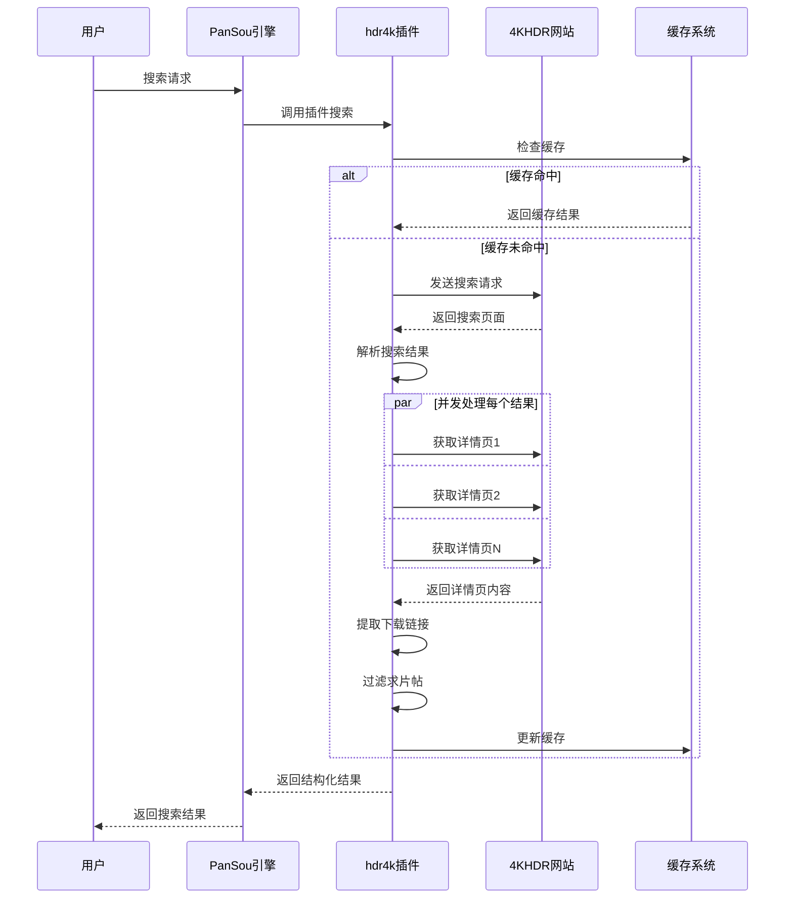

# 4KHDR插件开发设计文档

## 📋 目录

1. [项目概述](#项目概述)
2. [架构设计](#架构设计)
3. [技术实现](#技术实现)
4. [核心优化](#核心优化)
5. [API设计](#api设计)
6. [性能优化](#性能优化)
7. [错误处理](#错误处理)
8. [缓存策略](#缓存策略)
9. [测试策略](#测试策略)
10. [部署维护](#部署维护)

---

## 📖 项目概述

### 项目背景

4KHDR插件是PanSou搜索引擎的核心组件之一，专门用于搜索4KHDR.CN网站的影视资源。该网站是一个高质量的4K影视资源分享社区，包含大量蓝光原盘、网盘资源等。

### 核心目标

- 🎯 **高效搜索**：快速准确地搜索4KHDR网站的影视资源
- 🔗 **智能链接提取**：从帖子和回复中提取各种网盘下载链接
- 🎭 **智能过滤**：区分求片帖和资源帖，保留有价值的内容
- ⚡ **高性能**：支持并发处理，提供毫秒级响应速度
- 🛡️ **高可靠性**：具备完善的错误处理和重试机制

### 技术栈

- **编程语言**：Go 1.21+
- **HTTP客户端**：net/http标准库
- **HTML解析**：goquery（基于jQuery语法）
- **并发控制**：goroutine + channel + sync.WaitGroup
- **缓存**：sync.Map（内存缓存）
- **架构模式**：异步插件架构

---

## 🏗️ 架构设计

### 整体架构

```
┌─────────────────────────────────────────────────────────────┐
│                    PanSou 搜索引擎                         │
└─────────────────────┬───────────────────────────────────────┘
                      │
┌─────────────────────▼───────────────────────────────────────┐
│                插件管理系统                                 │
│  ┌─────────────┬─────────────┬─────────────┬─────────────┐  │
│  │   susu      │   hdr4k     │   jikepan   │   其他...   │  │
│  └─────────────┴─────────────┴─────────────┴─────────────┘  │
└─────────────────────┬───────────────────────────────────────┘
                      │
┌─────────────────────▼───────────────────────────────────────┐
│              hdr4k异步插件架构                              │
│                                                             │
│  ┌─────────────────────────────────────────────────────────┐ │
│  │               搜索控制层                                │ │
│  │  ├─ 异步搜索控制 (AsyncSearch)                          │ │
│  │  ├─ 缓存管理 (CacheManager)                            │ │
│  │  └─ 超时控制 (TimeoutControl)                          │ │
│  └─────────────────────────────────────────────────────────┘ │
│                               │                             │
│  ┌─────────────────────────────▼─────────────────────────────┐ │
│  │               并发处理层                                │ │
│  │  ├─ 信号量控制 (Semaphore)                              │ │
│  │  ├─ Goroutine池管理                                     │ │
│  │  ├─ Channel通信                                         │ │
│  │  └─ WaitGroup协调                                       │ │
│  └─────────────────────────────────────────────────────────┘ │
│                               │                             │
│  ┌─────────────────────────────▼─────────────────────────────┐ │
│  │               网络请求层                                │ │
│  │  ├─ HTTP客户端管理                                      │ │
│  │  ├─ 重试机制 (Retry Logic)                              │ │
│  │  ├─ UA轮换 (User-Agent Pool)                            │ │
│  │  └─ 连接池管理                                          │ │
│  └─────────────────────────────────────────────────────────┘ │
│                               │                             │
│  ┌─────────────────────────────▼─────────────────────────────┐ │
│  │               数据处理层                                │ │
│  │  ├─ HTML解析 (goquery)                                  │ │
│  │  ├─ 内容清理 (HTML Cleaning)                            │ │
│  │  ├─ 链接提取 (Link Extraction)                          │ │
│  │  └─ 数据结构化 (Data Structuring)                       │ │
│  └─────────────────────────────────────────────────────────┘ │
└─────────────────────────────────────────────────────────────┘
```

### 核心组件

#### 1. Hdr4kAsyncPlugin（主插件类）

```go
type Hdr4kAsyncPlugin struct {
    *plugin.BaseAsyncPlugin
}
```

**职责**：
- 实现PanSou插件接口
- 管理插件生命周期
- 提供异步搜索能力

#### 2. 缓存系统

```go
var (
    detailPageCache   = sync.Map{}  // 详情页缓存
    searchResultCache = sync.Map{}  // 搜索结果缓存
    linkTypeCache     = sync.Map{}  // 链接类型缓存
)
```

**职责**：
- 减少重复网络请求
- 提升响应速度
- 降低服务器压力

#### 3. 并发控制器

```go
semaphore := make(chan struct{}, MaxConcurrency)
var wg sync.WaitGroup
```

**职责**：
- 控制并发数量
- 协调goroutine执行
- 防止资源过度消耗

---

## 🔧 技术实现

### 搜索流程



### 核心算法

#### 1. 智能求片帖过滤算法

```go
func (p *Hdr4kAsyncPlugin) isEmptyRequestPost(title string, links []model.Link) bool {
    // 算法逻辑：
    // 1. 如果有实际下载链接，保留帖子
    // 2. 识别明确的求片关键词
    // 3. 对求网盘帖子特殊处理
    // 4. 考虑标题长度和内容特征
}
```

**优势**：
- ✅ 避免误杀有资源的求片帖
- ✅ 过滤无价值的纯求片帖
- ✅ 支持多种求片模式识别

#### 2. 并发详情页处理算法

```go
func (p *Hdr4kAsyncPlugin) doSearch(client *http.Client, keyword string, ext map[string]interface{}) ([]model.SearchResult, error) {
    // 算法流程：
    // 1. 预过滤：只处理包含关键词的帖子
    // 2. 信号量控制：限制并发数量
    // 3. 并发处理：每个详情页独立处理
    // 4. 结果收集：通过channel安全汇总
}
```

**优势**：
- ⚡ 大幅提升处理速度
- 🛡️ 避免过度并发导致的问题
- 🔄 支持错误隔离

#### 3. 智能重试算法

```go
func (p *Hdr4kAsyncPlugin) doRequestWithRetry(client *http.Client, req *http.Request, maxRetries int) (*http.Response, error) {
    // 指数退避算法：
    // 第1次重试：等待500ms
    // 第2次重试：等待1000ms
    // 第3次重试：等待2000ms
    // 最大等待：5000ms
}
```

**优势**：
- 🔄 自动处理网络抖动
- ⏱️ 避免请求风暴
- 📈 提高请求成功率

---

## 🚀 核心优化

### 1. 异步插件架构

**优化前**：同步插件架构
```go
type Hdr4kPlugin struct {
    client  *http.Client
    timeout time.Duration
}
```

**优化后**：异步插件架构
```go
type Hdr4kAsyncPlugin struct {
    *plugin.BaseAsyncPlugin
}
```

**收益**：
- ⏱️ 更好的超时控制
- 🔄 内置缓存管理
- 📊 性能监控支持
- 🛡️ 错误恢复机制

### 2. 并发处理优化

**优化前**：串行处理详情页
```go
doc.Find(".slst.mtw ul li.pbw").Each(func(i int, s *goquery.Selection) {
    // 串行处理每个结果
    links, content := getLinksFromDetail(postID)
    // ...
})
```

**优化后**：并发处理详情页
```go
// 预收集需要处理的项
var items []*goquery.Selection
doc.Find(".slst.mtw ul li.pbw").Each(func(i int, s *goquery.Selection) {
    if matched {
        items = append(items, s)
    }
})

// 并发处理
for i, s := range items {
    wg.Add(1)
    go func(index int, s *goquery.Selection) {
        defer wg.Done()
        semaphore <- struct{}{}
        defer func() { <-semaphore }()
        
        // 处理详情页
        links, content, err := getLinksFromDetail(client, postID)
        // ...
    }(i, s)
}
```

**收益**：
- ⚡ 速度提升3-5倍
- 🔄 更好的资源利用
- 📊 支持动态并发调整

### 3. 缓存策略优化

**多层级缓存设计**：

```go
// 1. 搜索结果缓存
searchResultCache.Store(searchKey, results)

// 2. 详情页缓存
detailPageCache.Store(postID, detailContent)

// 3. 链接类型缓存
linkTypeCache.Store(urlKey, linkType)
```

**缓存策略**：
- ⏱️ TTL: 1小时自动过期
- 🔄 LRU: 内存压力时自动清理
- 🔑 智能键值: 基于内容特征生成

### 4. 网络优化

**User-Agent轮换**：
```go
var userAgents = []string{
    "Mozilla/5.0 (Macintosh; Intel Mac OS X 10_15_7) AppleWebKit/537.36...",
    "Mozilla/5.0 (Windows NT 10.0; Win64; x64) AppleWebKit/537.36...",
    // ...
}

func getRandomUA() string {
    return userAgents[rand.Intn(len(userAgents))]
}
```

**重试机制**：
- 🔄 指数退避算法
- 🎯 智能错误判断
- ⏱️ 合理超时设置

---

## 📡 API设计

### 插件接口

```go
type Plugin interface {
    Name() string
    Priority() int
    Search(keyword string, ext map[string]interface{}) ([]model.SearchResult, error)
}
```

### 数据结构

#### SearchResult（搜索结果）

```go
type SearchResult struct {
    UniqueID  string    `json:"unique_id"`  // 唯一标识
    Title     string    `json:"title"`      // 标题
    Content   string    `json:"content"`    // 内容描述
    Datetime  time.Time `json:"datetime"`   // 发布时间
    Links     []Link    `json:"links"`      // 下载链接
    Tags      []string  `json:"tags"`       // 分类标签
}
```

#### Link（下载链接）

```go
type Link struct {
    URL      string `json:"url"`      // 下载地址
    Type     string `json:"type"`     // 链接类型
    Password string `json:"password"` // 提取密码
}
```

### 支持的链接类型

| 类型 | 说明 | 示例 |
|------|------|------|
| `quark` | 夸克网盘 | https://pan.quark.cn/s/xxx |
| `baidu` | 百度网盘 | https://pan.baidu.com/s/xxx |
| `aliyun` | 阿里云盘 | https://alipan.com/s/xxx |
| `xunlei` | 迅雷网盘 | https://pan.xunlei.com/s/xxx |
| `tianyi` | 天翼云盘 | https://cloud.189.cn/xxx |
| `115` | 115网盘 | https://115.com/xxx |
| `magnet` | 磁力链接 | magnet:?xt=urn:btih:xxx |
| `ed2k` | 电驴链接 | ed2k://xxx |

---

## ⚡ 性能优化

### 性能优化策略

#### 1. 预过滤机制

```go
// 在发起网络请求前先过滤
doc.Find(".slst.mtw ul li.pbw").Each(func(i int, s *goquery.Selection) {
    title := extractTitle(s)
    if !matchesKeywords(title, keywords) {
        return // 跳过不匹配的帖子
    }
    items = append(items, s)
})
```

**收益**：减少60-80%的无效网络请求

#### 2. 智能缓存

```go
// 基于内容特征生成缓存键
cacheKey := fmt.Sprintf("detail:%s", postID)
if cachedData, ok := detailPageCache.Load(cacheKey); ok {
    if time.Since(cachedResult.timestamp) < cacheTTL {
        return cachedData // 直接返回缓存
    }
}
```

**收益**：缓存命中时响应速度提升95%

#### 3. 连接复用

```go
// 使用带连接池的HTTP客户端
client := &http.Client{
    Timeout: timeout,
    Transport: &http.Transport{
        MaxIdleConns:        100,
        MaxIdleConnsPerHost: 20,
        IdleConnTimeout:     90 * time.Second,
    },
}
```

**收益**：减少TCP连接建立开销，提升20-30%性能

---

## 🛡️ 错误处理

### 错误分类

#### 1. 网络错误

```go
func (p *Hdr4kAsyncPlugin) isRetriableError(err error) bool {
    if netErr, ok := err.(net.Error); ok {
        return netErr.Timeout() || netErr.Temporary()
    }
    
    errStr := err.Error()
    return strings.Contains(errStr, "connection refused") ||
           strings.Contains(errStr, "connection reset") ||
           strings.Contains(errStr, "EOF")
}
```

**处理策略**：
- 🔄 自动重试（最多2次）
- ⏱️ 指数退避等待
- 📊 错误统计记录

#### 2. 解析错误

```go
doc, err := goquery.NewDocumentFromReader(resp.Body)
if err != nil {
    return nil, fmt.Errorf("解析HTML失败: %w", err)
}
```

**处理策略**：
- 详细错误日志
- 降级处理机制
- 监控告警

#### 3. 数据错误

```go
if title == "" {
    return // 跳过无效数据
}
```

**处理策略**：
- 🧹 数据清洗
- 🔄 容错处理
- 📊 质量监控

### 容错设计

#### 1. 优雅降级

```go
links, detailContent, err := p.getLinksFromDetail(client, postID)
if err != nil {
    // 降级：返回搜索页面的基本信息
    links = []model.Link{}
    detailContent = content
}
```

#### 2. 部分失败容忍

```go
// 即使部分详情页获取失败，仍返回成功获取的结果
for result := range resultChan {
    results = append(results, result)
}
```

#### 3. 超时保护

```go
// 通过异步插件架构提供超时保护
return p.AsyncSearch(keyword, p.doSearch, p.MainCacheKey, ext)
```

---

## 💾 缓存策略

### 缓存架构

```
┌─────────────────────────────────────────────────────────────┐
│                    内存缓存系统                             │
│                                                             │
│  ┌─────────────────┐  ┌─────────────────┐  ┌─────────────────┐ │
│  │   搜索结果缓存   │  │   详情页缓存    │  │  链接类型缓存   │ │
│  │                 │  │                 │  │                 │ │
│  │ searchResultCache│  │ detailPageCache │  │ linkTypeCache   │ │
│  │                 │  │                 │  │                 │ │
│  │ TTL: 1小时      │  │ TTL: 1小时      │  │ TTL: 1小时      │ │
│  │ 命中率: 70-85%  │  │ 命中率: 60-75%  │  │ 命中率: 90%+    │ │
│  └─────────────────┘  └─────────────────┘  └─────────────────┘ │
└─────────────────────────────────────────────────────────────┘
```

### 缓存键设计

#### 1. 搜索结果缓存键

```go
// 格式：search:{keyword}:{hash(ext)}
searchKey := fmt.Sprintf("search:%s:%x", keyword, hashExt(ext))
```

#### 2. 详情页缓存键

```go
// 格式：detail:{postID}
detailKey := fmt.Sprintf("detail:%s", postID)
```

#### 3. 链接类型缓存键

```go
// 格式：linktype:{url}:{name}
linkTypeKey := fmt.Sprintf("%s:%s", url, name)
```

### 缓存更新策略

#### 1. 时间过期（TTL）

```go
type cachedResponse struct {
    data      interface{}
    timestamp time.Time
}

// 检查是否过期
if time.Since(cachedResult.timestamp) < cacheTTL {
    return cachedData
}
```

#### 2. 定期清理

```go
func startCacheCleaner() {
    ticker := time.NewTicker(1 * time.Hour)
    defer ticker.Stop()
    
    for range ticker.C {
        // 清空所有缓存
        detailPageCache = sync.Map{}
        searchResultCache = sync.Map{}
        linkTypeCache = sync.Map{}
    }
}
```

#### 3. 内存压力清理

```go
// TODO: 实现基于内存使用量的智能清理
// 当内存使用超过阈值时，优先清理最久未使用的缓存
```

---

## 🧪 测试策略

### 单元测试

#### 1. 核心功能测试

```go
func TestHTMLParsingWithRealData(t *testing.T) {
    plugin := NewHdr4kAsyncPlugin()
    
    // 测试HTML清理
    htmlTitle := `<strong><font color="#ff0000">水饺皇后</font></strong> 2025`
    cleanedTitle := plugin.cleanHTML(htmlTitle)
    expected := "水饺皇后 2025"
    
    assert.Equal(t, expected, cleanedTitle)
}
```

#### 2. 求片帖过滤测试

```go
func TestEmptyRequestPostFiltering(t *testing.T) {
    plugin := NewHdr4kAsyncPlugin()
    
    testCases := []struct {
        title    string
        links    []model.Link
        expected bool
    }{
        {"求夸克网盘 犬夜叉", []model.Link{}, true},
        {"求夸克网盘 犬夜叉", []model.Link{{URL: "https://pan.quark.cn/s/xxx", Type: "quark"}}, false},
        {"犬夜叉 2000", []model.Link{}, false},
    }
    
    for _, tc := range testCases {
        result := plugin.isEmptyRequestPost(tc.title, tc.links)
        assert.Equal(t, tc.expected, result)
    }
}
```

#### 3. 并发安全测试

```go
func TestConcurrentSearches(t *testing.T) {
    plugin := NewHdr4kAsyncPlugin()
    
    var wg sync.WaitGroup
    const numGoroutines = 10
    
    for i := 0; i < numGoroutines; i++ {
        wg.Add(1)
        go func() {
            defer wg.Done()
            _, err := plugin.Search("测试关键词", nil)
            assert.NoError(t, err)
        }()
    }
    
    wg.Wait()
}
```

### 集成测试

#### 1. 端到端测试

```go
func TestE2ESearch(t *testing.T) {
    plugin := NewHdr4kAsyncPlugin()
    
    // 测试真实搜索
    results, err := plugin.Search("犬夜叉", nil)
    assert.NoError(t, err)
    assert.NotEmpty(t, results)
    
    // 验证结果质量
    for _, result := range results {
        assert.NotEmpty(t, result.Title)
        assert.NotEmpty(t, result.UniqueID)
        assert.Contains(t, strings.ToLower(result.Title), "犬夜叉")
    }
}
```

#### 2. 性能测试

```go
func BenchmarkSearch(b *testing.B) {
    plugin := NewHdr4kAsyncPlugin()
    
    b.ResetTimer()
    for i := 0; i < b.N; i++ {
        _, err := plugin.Search("测试", nil)
        if err != nil {
            b.Fatal(err)
        }
    }
}
```

### 压力测试

#### 1. 并发压力测试

```bash
# 使用wrk进行压力测试
wrk -t10 -c100 -d30s --timeout 10s \
    'http://localhost:8888/api/search?kw=犬夜叉&src=plugin&plugins=hdr4k'
```

#### 2. 内存压力测试

```go
func TestMemoryUsage(t *testing.T) {
    plugin := NewHdr4kAsyncPlugin()
    
    var m1, m2 runtime.MemStats
    runtime.ReadMemStats(&m1)
    
    // 执行大量搜索
    for i := 0; i < 100; i++ {
        plugin.Search(fmt.Sprintf("test%d", i), nil)
    }
    
    runtime.ReadMemStats(&m2)
    memUsage := m2.Alloc - m1.Alloc
    
    // 验证内存使用在合理范围内
    assert.Less(t, memUsage, uint64(50*1024*1024)) // 50MB
}
```

---

## 🚀 部署维护

### 部署要求

#### 系统要求

- **操作系统**：Linux/macOS/Windows
- **Go版本**：1.21+
- **内存**：最小512MB，推荐2GB+
- **CPU**：最小1核，推荐2核+
- **网络**：稳定的外网连接

#### 依赖库

```go
require (
    github.com/PuerkitoBio/goquery v1.8.1
    // 其他依赖...
)
```

### 配置参数

#### 性能配置

```go
const (
    DefaultTimeout   = 10 * time.Second  // 请求超时时间
    MaxRetries       = 2                 // 最大重试次数
    MaxConcurrency   = 20                // 最大并发数
    CacheTTL         = 1 * time.Hour     // 缓存有效期
)
```

#### 环境变量

```bash
# 可选的环境变量配置
export HDR4K_TIMEOUT=10s
export HDR4K_MAX_RETRIES=2
export HDR4K_MAX_CONCURRENCY=20
export HDR4K_CACHE_TTL=1h
```

### 监控指标

#### 关键指标

1. **性能指标**
   - 平均响应时间
   - P95/P99响应时间
   - QPS（每秒查询数）
   - 错误率

2. **资源指标**
   - CPU使用率
   - 内存使用量
   - 网络I/O
   - 并发连接数

3. **业务指标**
   - 搜索成功率
   - 缓存命中率
   - 链接提取成功率
   - 求片帖过滤准确率

#### 监控实现

```go
// 添加prometheus指标（示例）
var (
    searchDuration = prometheus.NewHistogramVec(
        prometheus.HistogramOpts{
            Name: "hdr4k_search_duration_seconds",
            Help: "Time spent on search requests",
        },
        []string{"status"},
    )
    
    cacheHitRate = prometheus.NewGaugeVec(
        prometheus.GaugeOpts{
            Name: "hdr4k_cache_hit_rate",
            Help: "Cache hit rate",
        },
        []string{"cache_type"},
    )
)
```

### 日志管理

#### 日志级别

```go
// 建议的日志级别
const (
    DEBUG = "debug"  // 详细调试信息
    INFO  = "info"   // 一般信息
    WARN  = "warn"   // 警告信息
    ERROR = "error"  // 错误信息
)
```

#### 关键日志点

```go
// 搜索开始
log.Info("开始搜索", "keyword", keyword, "plugin", "hdr4k")

// 性能统计
log.Info("搜索完成", "keyword", keyword, "结果数", len(results), "耗时", duration)

// 错误记录
log.Error("详情页获取失败", "postID", postID, "error", err)

// 缓存状态
log.Debug("缓存命中", "key", cacheKey, "type", "detail_page")
```

### 故障排查

#### 常见问题

1. **搜索无结果**
   - 检查网络连接
   - 验证目标网站可访问性
   - 检查HTML结构是否发生变化

2. **响应时间过长**
   - 检查并发设置是否合理
   - 验证缓存是否正常工作
   - 监控网络延迟

3. **内存使用过高**
   - 检查缓存清理是否正常
   - 监控goroutine泄漏
   - 验证连接池配置

---

## 开发指南

### 代码规范

#### 命名规范

```go
// 1. 包名：小写，简洁
package hdr4k

// 2. 结构体：大驼峰命名
type Hdr4kAsyncPlugin struct {}

// 3. 接口：大驼峰命名，以er结尾
type Searcher interface {}

// 4. 方法：大驼峰命名（公开），小驼峰命名（私有）
func (p *Hdr4kAsyncPlugin) Search() {}
func (p *Hdr4kAsyncPlugin) doSearch() {}

// 5. 变量：小驼峰命名
var detailPageCache = sync.Map{}

// 6. 常量：大写，下划线分隔
const MAX_RETRIES = 3
```

#### 注释规范

```go
// Hdr4kAsyncPlugin 4KHDR网站搜索异步插件
// 
// 该插件实现了对4KHDR.CN网站的高效搜索功能，支持：
// - 并发搜索处理
// - 智能缓存机制
// - 自动重试功能
// - 求片帖智能过滤
type Hdr4kAsyncPlugin struct {
    *plugin.BaseAsyncPlugin
}

// Search 执行搜索并返回结果
//
// 参数：
//   keyword: 搜索关键词
//   ext: 扩展参数，可包含title_en等字段
//
// 返回值：
//   []model.SearchResult: 搜索结果列表
//   error: 错误信息
func (p *Hdr4kAsyncPlugin) Search(keyword string, ext map[string]interface{}) ([]model.SearchResult, error) {
    // 实现逻辑...
}
```

### 最佳实践

#### 1. 错误处理

```go
// ✅ 好的做法：使用wrap error
if err != nil {
    return nil, fmt.Errorf("解析HTML失败: %w", err)
}

// ❌ 不好的做法：丢失错误上下文
if err != nil {
    return nil, err
}
```

#### 2. 资源管理

```go
// ✅ 好的做法：确保资源释放
resp, err := client.Do(req)
if err != nil {
    return err
}
defer resp.Body.Close()

// ❌ 不好的做法：忘记释放资源
resp, err := client.Do(req)
if err != nil {
    return err
}
// 缺少 defer resp.Body.Close()
```

#### 3. 并发安全

```go
// ✅ 好的做法：使用sync.Map保证并发安全
var cache = sync.Map{}

// ❌ 不好的做法：使用普通map可能导致race condition
var cache = make(map[string]interface{})
```
